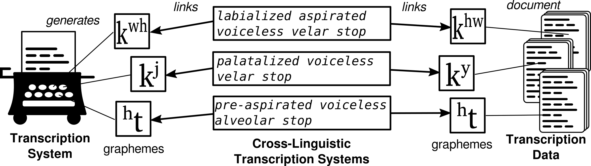

# Cross-Linguistic Transcription Systems (Cormac Anderson, Johann-Mattis List, Tiago Tresoldi)

## 1 Introduction

As we discussed when dealing with Concepticon in Session 3, contrary to what non-practitioners might expect, the systems of phonetic notation used by linguists are highly idiosyncratic. Not only do various linguistic subfields disagree on the specific symbols they use to denote the speech sounds of languages, but also in large databases of sound inventories considerable variation can be found. Inspired by other efforts to link cross-linguistic data with help of reference catalogues (such as Glottolog and Concepticon) across different resources, we have also focused in linking different phonetic notation systems to a catalogue of speech sounds. This is achieved with the help of a database accompanied by a software framework that uses a limited but easily extendable set of non-binary feature values to allow for quick and convenient registration of different transcription systems, while at the same time linking to additional datasets with restricted inventories. Linking different transcription systems enables us to conveniently translate between different phonetic transcription systems, linking sounds to databases allows users quick access to various kinds of metadata, including feature values, statistics on phoneme inventories, and information on prosody and sound classes.

Phonetic transcription has a long tradition in historical linguistics. Efforts to design a unified transcription system capable of representing and distinguishing all the sounds in the languages of the world go back to the late 19th century, culminating with the efforts of the International Phonetic Association (see [Kalusky 2017:7f](:bib:Kalusky2017)). In contrast to writing systems targeted at encoding the speech of a single language variety in a visual medium, phonetic transcription aims at representing different kinds of speech in a unified system, which ideally would enable those trained in the system to reproduce foreign speech directly.
Apart from the primary role which phonetic transcription plays in teaching foreign languages, it is also indispensable for the purposes of language comparison, both typological and historical. In this sense, the symbols which scholars use in order to transcribe speech sounds, that is, the graphemes, which we understand as sequences of one or more glyphs, serve as comparative concepts in the sense of [Haspelmath (2010)](:bib:Haspelmath2010). While the usefulness of phonetic transcription may be evident to typologists interested in the diversity of speech sounds (although see critiques of this approach to phonological typology, i.a. Simpson ([1999](:bib:Simpson1999)), the role of unified transcription systems like the International Phonetic Alphabet (IPA) is often regarded as less important in historical linguistics, where scholars often follow the algebraic tradition of [Saussure (1916)](:bib:Saussure1916) (already implicit in [Saussure 1878](:bib:Saussure1878)). This emphasises the systematic aspect of  historical language comparison, in which the distinctiveness of sound units within a system is more important than how they compare in substance across a sample of genetically related languages. If we leave the language-specific level of historical language comparison, however, and investigate general patterns of sound change in the languages of the world, it is obvious that this can only be done with help of comparable transcription systems serving as comparative concepts. 

When dealing with phonetic transcriptions, it is useful to distinguish *transcription systems* from *transcription data*. The former describe a set of symbols and rules for symbol combinations which can be used to represent speech in the medium of writing, while the latter result from the application of a given transcription system and aim at displaying linguistic diversity in terms of sound inventories or lexical datasets. While transcription systems are generative in that they can be used to encode sounds by combining the basic material, transcription data are static and fixed in size (at least for a given version published at a certain point in time). Transcription data have become increasingly important, with recent efforts to provide cross-linguistic accounts of sound inventories ([Moran et al. 2014](:bib:Moran2014), [Maddieson et al. 2013](:bib:Maddieson2013)), but in some sense, we can say that every dictionary or word list that aims at representing the pronunciation of a language can be considered as transcription data in a broad sense. 


## 1 Theoretical Background

### 1.1 Overview on Transcription Systems

### 1.2 Comparability of Transcription Systems

When dealing with transcription systems and transcription data, linguists face several problems. Some of these are problems of a practical nature, which we explore further below, while others are of a theoretical nature, and touch upon long-standing issues in phonology and phonetics, and the relationship between the two. Among these theoretical problems, are the those of commensurability, of context, and of resolution. 
In spite of frequent attempts to compare phonemic inventories in phonological typology ([Dryer and Haspelmath 2011](:bib:Wals2011), [Maddieson 1984](:bib:Maddieson1984)) these efforts are beset by serious difficulties. The classical structuralist treatment of the phoneme considers it to be a relational entity ([Trubetzkoy 1939](:bib:Trubetzkoy1939a)), the value of which is dependent on its place with respect to other phonemes within a system. In this understanding, the phonemes of one language are not commensurate to those of another language: it is only as a member of a system that a phoneme finds its value. This critique is taken up by Simpson ([1999](:bib:Simpson1999)) who argues that the allophone replaces the phoneme in large databases, thereby reducing  “the phonemic system of a language to a small, arbitrary selection of its phonetics”. Although this problem cannot really be resolved, we note that different phonological databases have attempted to address it in different ways. In LAPSyD [Maddieson et al. 2013](:bib:Maddieson2013)), the symbols chosen for the phonemes are often frequently occurring ones, abstracting away from too much phonetic detail. In PHOIBLE ([Moran et al. 2014](:bib:Moran2014), on the other hand, phonemes are often transcribed with great phonetic detail, with numerous diacritics. While at first glance the latter approach might appear preferable, as it gives more information, it runs into serious difficulties, given Simpson’s critique above.

The crux of this problem is that the realisation of a given phoneme depends considerably on context. For example, the German stops typically transcribed /b/, /d/, and /g/ are pronounced voiceless when in final position, whereas between vowels they are pronounced with voice. In European Spanish, the voiced stops /b/, /d/ and /g/ only occur with the phonetic values [b],  [d], and [g] in initial position, whereas elsewhere they are invariably pronounced as fricatives [β],  [ð], and [ɣ]. It is not clear, in such cases, which set of symbols should be used, and even if a principled decision could be made (e.g. based on frequency, [Bybee 2001](:bib:Bybee2001)), a great loss of information is involved in choosing one symbol over the other – it is equally misleading to characterise Spanish as a language without voiced stops or as a language without voiced fricatives. Such difficulties are not only of relevance in phonological typology, but  can have serious repercussions in historical linguistics as well. To take an example, linguists typically transcribe two series of stops in Scottish Gaelic – aspirated /pʰ/, /tʰ/, and /kʰ/ and unaspirated /p/, /t/, and /k/. In Modern Irish, on the other hand, the convention is to transcribe rather voiceless /p/, /t/, and /k/ and voiced /b/, /d/, and /g/. In reality, however, the voiceless stops of Irish are also aspirated, and the voiced ones are only passively voiced (i.e. it is an ‘aspirating’ language in the parlance of laryngeal typology (Honeybone 2005[:bib:Honeybone2005])). The difference between these two very closely related languages lies solely in the fact that in Irish there is perhaps a greater tendency to passively voice the second series. To a naïve historical linguist, however (or indeed, to an even more naïve algorithm), this minor difference would seem a highly significant one, and would require the postulation of entirely spurious sound changes (“deaspiration” and “voicing” of the two Irish series, for example) to account for the difference.


This last example leads to a further difficulty: the level of resolution of the different transcription datasets available varies widely. Sapir ([1930](:bib:Sapir1930)) gives an extremely detailed account of the phonological system of Southern Paiute, very rich in phonetic detail. However, in our only description of the closely-related language Chemehuevi ([Press 1980](:bib:Press1980)) there is a comparative paucity of discussion of phonetic particulars. This is not to criticise her grammar (indeed one could make exactly the opposite statement about the quality of the syntactic description in her grammar and Sapir’s), but rather to recognise that these two sets of transcription data have a very different level of resolution. Obviously, there are great difficulties inherent in comparing datasets of differing levels of resolution: absence of evidence (e.g. in some phonetic particular of Chemehuevi) does not equate to evidence of absence. Our degree of knowledge about the phonetics and phonology of the languages of the world varies greatly, from practically nothing to voluminous descriptions detailing small sociolectal, dialectal, and idiolectal divergences.

One might ask then, given these difficulties we recognise, what the value of this enterprise is. We believe that notwithstanding these theoretical difficulties, some practical progress can still be made. Given that transcription systems are rarely standardised in a rigid manner, and allow for a certain amount of freedom of choice, scholars have come up with many ad-hoc solutions which are reflected in specific traditions which have developed in different sub-fields of comparative linguistics. As we have seen above, in different linguistic traditions there are specific particularities in the representation of sounds in a written medium. Scholars are usually aware of these differences in their field of expertise, but when it comes to global accounts of phonetic and phonological diversity, the particularities of the different traditions may easily introduce errors in our analyses. A great number of the difficulties arise not from the broader theoretical problems outlined above, but from exactly these idiosyncrasies of tradition or personal taste. In some cases, different linguists represent sounds which are fundamentally the same in different ways (see, for instance, the examples from Pacific languages in 2.1.4). Convenience also plays a role here: as it is inconvenient to write a superscript ‹h› to mark aspiration of a stop, scholars often just use the normal ‹h› instead, assuming that their colleagues will understand, when reading the introduction to their field work notes or grammars. An ‹h› following a stop, however, does not necessarily point to aspiration in all linguistic traditions. In Australian linguistics, for example, it often denotes a laminal stop ([Dench 2002](:bib:Dench2002)). 

Further problems that scholars who work in a qualitative framework may not even realise arise from the nature of Unicode, which offers different encodings for characters that look the same ([Cysouw and Moran 2017: 54](:bib:Cysouw2017)). While scholars working qualitatively will have no problems to see that ‹ə› (Unicode 0259, Latin Small Letter Schwa) and ‹ə› (Unicode 01DD, Latin Small Letter Turned E) are identical, the two symbols are different for a computer, as they are represented internally by different code points. As a result, an automatic aggregation of data will treat these symbols as different sounds when comparing languages automatically, or when aggregating information on sound inventories of the languages in the world. 

Judging from the above-mentioned examples, we can identify identify three major problems which make it hard for us to compare phonetic transcriptions cross-linguistically, namely the problem of (a) errors introduced due to the wrong application of the Unicode standard, (b) general incomparability due to the use of different transcription systems, and (c) ambiguities introduced by scholars due to individual transcription preferences. In order to render our transcription systems and datasets cross-linguistically comparable, both for humans and for machines, it therefore seems indispensable to work on a system that normalizes transcriptions across different transcription systems and transcription data by linking existing transcription systems and datasets to a unified standard. Such a system should ideally (a) ease the process of writing phonetic transcriptions (e.g., by providing tools that automatically check and normalize transcriptions while scholars are creating them), (b) ease the comparison of existing transcriptions (e.g., by providing an internal reference point for a given speech sound which links to different grapheme representations in different transcription systems and datasets), and (c) provide a standard against which scholars can test existing data.


## 2 The Cross-Linguistic Transcription System Initiative

In the spirit of reference catalogues for cross-linguistically linked data (Glottolog and
Concepticon, see Session 3), we have established a preliminary version of a reference
catalogue for phonetic transcription systems and datasets, called Cross-Linguistic Transcription Systems (CLTS).
The goal of the CLTS framework is to systematically
increase the comparability of linguistic transcriptions by linking graphemes generated by
transcription systems and graphemes documented in transcription datasets to unique feature
bundles drawn from a simple but efficient feature system. With due respect to all obstacles
which the documentation of speech through transcription may face in theory and practice,
the CLTS system can be seen as a first step towards identifying graphemes across
transcription systems and transcription datasets with unique speech sounds. In this sense,
CLTS also aids the translation between transcription systems and datasets, and can further
serve as a standard for transcription in practice. Figure 1 illustrates this integrative role of
CLTS.



### 2.1 Basic Aspects of CLTS

#### Sound Classes in CLTS

In order to link graphemes in transcription systems and transcription datasets to feature
bundles, it is useful to distinguish rudimentary classes of sounds. We distinguish three
basic sound classes (consonants, vowels, and tones), a specific class of markers (to indicate
syllable or morpheme breaks or word boundaries) and two derived classes (consonant
clusters and diphthongs). As of the moment, we do not allow for triphthongs and clusters of
more than two consonants (although they could be added at a later stage), in order to keep
the system manageable. Clicks are represented as a specific type of consonant that has
click or nasal-click as its manner. The representation of tones as a sound class of itself is
necessitated by the fact that many phonetic descriptions of tone languages (especially in
South-East-Asian languages) represent tone separately. It is further justified by phonological
theory, given that tones in many languages may change independently, often correlated with
factors that cannot be tied to a segmental context.

Complex sound classes in CLTS are not explicitly defined, but instead automatically
derived by identifying the basic graphemes of which they consist. Diphthongs are thus
defined by two vowels, and the grapheme ‹oe›, for example, is treated as a diphthong
consisting of a rounded close-mid back and an unrounded close-mid front vowel. In a similar
way, we allow complex consonant clusters to be defined in order to transcribe, for example,
doubly articulated consonants or clicks containing a pulmonic release (see Table 1 for
examples).

Class | Grapheme | Features
--- | --- | ---
consonant | kʷʰ | labialized aspirated velar stop
vowel | ṵ | creaky rounded close back
cluster | kp | from voiceless velar stop to voiceless bilabial stop
diphthong | au̯ | from unrounded open front to non-syllabic rounded close back
tone | ²¹⁴ | contour from-mid-low via-low to-mid-high
marker | + | marker for morpheme boundaries
Table 1: Examples for the basic classes of sounds represented in CLTS.

#### Feature Bundles as Comparative Concepts

In order to ensure that we can compare sounds across different transcription systems and datasets, a feature system that can be used to model sounds as feature bundles, serving as comparative concept in the sense of [Haspelmath (2010)](:bib:Haspelmath2010) is indispensable. We therefore propose specific feature systems for each of our three sound classes (consonant, vowel, tone), which allow us to identify a large number of different sounds across transcription systems and transcription datasets. The features themselves can be roughly divided into obligatory features (like manner, place, and phonation in consonants, and roundedness, height, and centrality in vowels), and optional features (usually binary, i.e., present or absent, such as duration, nasalization, aspiration). Our current feature system contains 23 consonant features, 23 vowel features and 4 tonal features.

Our choice of features derives from the graphemic representation of sounds in the system of the IPA. It is practically oriented and does not claim to represent any deeper truth about distinctive features in phonology. Instead we focus on being able to align the features as easily as possible with a given graphemic representation of a particular sound in a transcription system. As a result, some features may appear awkward and even naïve, from a phonological perspective. For example, instead of distinguishing ejectives from plain consonants by manner only (contrasting “ejective stops” and “plain stops”), we code ejectivity as an additional feature with a binary value (present or absent). In a similar way, we do not distinguish between different kinds of phonation (voiced, breathy-voiced, creaky-voiced, etc.) but code separately for breathiness, creakiness, and phonation (voiced or voiceless). The advantage of this coding practice is that we can easily infer sounds that we have not yet listed in our database based on the combination of base graphemes and diacritics. In addition, we can also avoid discussions in those cases where linguists often agree. If we explicitly treated the diacritic ‹ʱ› in the IPA transcription system as indicating breathiness and implying voiced phonation, we would have problem in distinguishing the admittedly rare instances where scholars explicitly transcribe voiceless stops with breathy release using a voiceless stop in combination with the diacritic for breathy voice (‹pʱ›, ‹tʱ›, ‹kʱ›, etc.) in order to indicate a voiceless initial with (breathy) voiced aspiration.

Class | Feature Name | Feature Values
--- | --- | ---
consonant | place | alveolar, alveolo-palatal, bilabial, dental, epiglottal, glottal, labial, labialized-palatal, labialized-velar, labio-dental, palatal, palatal-velar, pharyngeal, post-alveolar, retroflex, uvular, velar
consonant | manner | affricate, approximant, click, fricative, implosive, nasal, nasal-click, stop, tap, trill
consonant | preceding | pre-aspirated, pre-glottalized, pre-labialized, pre-nasalized, pre-palatalized
consonant | release | unreleased, with-lateral-release, with-mid-central-vowel-release, with-nasal-release
consonant | voicing | devoiced, revoiced
consonant | phonation | voiced, voiceless
consonant | stress | primary-stress, secondary-stress
consonant | palatalization | labio-palatalized, palatalized
consonant | laminality | apical, laminal
consonant | aspiration | aspirated, aspirated.sibilancy:sibilant
consonant | ejection | ejective
consonant | pharyngealization | pharyngealized
consonant | creakiness | creaky
consonant | breathiness | breathy
consonant | syllabicity | syllabic
consonant | laterality | lateral
consonant | articulation | strong
consonant | labialization | labialized
consonant | velarization | velarized
consonant | duration | long
consonant | nasalization | nasalized
consonant | sibilancy | sibilant
consonant | glottalization | glottalized
vowel | tone | with_downstep, with_extra-high_tone, with_extra-low_tone, with_falling_tone, with_global_fall, with_global_rise, with_high_tone, with_low_tone, with_mid_tone, with_rising_tone, with_upstep
vowel | height | close, close-mid, mid, near-close, near-open, open, open-mid
vowel | centrality | back, central, front, near-back, near-front
vowel | duration | long, mid-long, ultra-long, ultra-short
vowel | stress | primary-stress, secondary-stress
vowel | roundedness | rounded, unrounded
vowel | rounding | less-rounded, more-rounded
vowel | centralization | centralized, mid-centralized
vowel | tongue_root | advanced-tongue-root, retracted-tongue-root
vowel | raising | lowered, raised
vowel | voicing | devoiced
vowel | pharyngealization | pharyngealized
vowel | creakiness | creaky
vowel | nasalization | nasalized
vowel | breathiness | breathy
vowel | syllabicity | non-syllabic
vowel | advancement | advanced
vowel | articulation | strong
vowel | velarization | velarized
vowel | frication | with-frication
vowel | rhotacization | rhotacized
vowel | retraction | retracted
vowel | glottalization | glottalized
tone | start | from-high, from-low, from-mid, from-mid-high, from-mid-low, neutral
tone | contour | contour, falling, flat, rising, short
tone | middle | via-high, via-low, via-mid, via-mid-high, via-mid-low
tone | end | to-high, to-low, to-mid, to-mid-high, to-mid-low

#### Transcription Systems

A transcription system is understood as a generative entity in CLTS, being able to create sounds that were not produced explicitly before (although the ultimate productivity of a transcription system is, of course, limited). Transcription systems are defined by providing graphemes for the basic sound classes (consonants, vowels, tones) which are explicitly defined and linked to our feature system. Additionally, diacritics can be defined and may precede or follow the base graphemes, adding one additional feature per symbol to the base grapheme, depending on their position and the sound class of the base grapheme. In the IPA system, for example, the diacritic ‹ʰ› can only be attached to consonants, but it will evoke different feature values when preceding ‹ʰt› (pre-aspirated voiceless alveolar stop consonant) or following ‹tʰ› (aspirated voiceless alveolar stop consonant) the base grapheme ‹t›.

Transcription systems can furthermore specify aliases, both for base graphemes and for diacritics. The IPA, for example, allows to indicate breathiness by two diacritics, the ‹dʱ› which we mentioned above, and the ‹◌̤›, which is placed under the base grapheme. In the CLTS framework, both glyphs can be parsed, and both ‹dʱ› and ‹d̤› would be interpreted as a breathy voiced alveolar stop, but ‹dʱ› would be treated as the regular grapheme representation and ‹d̤› as its alias. Another important example for aliases are affricates like the voiceless alveolar affricate which can be rendered as either a single symbol ‹ʦ› (Unicode 02A6) or two symbols ‹ts› (Unicode 0074 u. 0073, the preferred version in CLTS).1 In these and many other cases, the CLTS framework correctly recognizes the sounds denoted by the graphemes while at the same time proposing a default representation of ambiguous graphemes in a given transcription system.

#### Transcription Data

CLTS currently links 15 different transcription datasets, summarized in Table 2. The datasets were selected for different reasons. We tried to assemble as many of the cross-linguistic sound inventory datasets as possible, since apart from the comparison of Phoible with Ruhlen’s database by Dediu and Moisik (2016), these existing databsets have not yet been thoroughly compared. Given the large number of sound segments which one can find in these datasets (most of them representing a supposedly strict version of IPA), they provide a useful way to test how well our framework recognizes sounds written in IPA which were not explicitly defined.

ID | Name | Source | Graphemes | CLTS | Unique | Coverage
--- | --- | --- | --- | --- | --- | ---
APiCS | Atlas of Pidgin and Creole Language Structures Online | Michaelis et al. 2013 | 177 | 177 | 177 | 100
BDPA | Benchmark database of phonetic alignments | List and Prokić 2014 | 1466 | 1156 | 1112 | 78
BJDX | Chinese Dialect Vocabularies | Beijing Daxue 1964 | 124 | 124 | 121 | 100
Chomsky | Sound Pattern of English | Chomsky and Halle 1968 | 45 | 45 | 45 | 100
Diachronica | Index Diachronica | Anonymous 2014, D. 2017 | 652 | 523 | 495 | 80
Eurasian | Database of Eurasian Phonological Inventories | Nikolaev 2015 | 1562 | 1321 | 1274 | 85
LAPSyD | Lyon-Albuquerque Phonological Systems Database | Maddieson et al. 2013 | 795 | 693 | 689 | 87
Multimedia | Multimedia IPA Charts | Department of Linguistics 2017 | 138 | 124 | 124 | 90
Nidaba | Lexicon Analysis and Comparison | Eden 2015 | 1936 | 1729 | 1729 | 89
PanPhon | PanPhon Project | Mortensen 2017 | 6334 | 5871 | 5232 | 93
PBase | PBase Project | Mielke 2008 | 1068 | 849 | 827 | 80
Phoible | Phonetics Information Base and Lexicon | Moran et al. 2014 | 1843 | 1528 | 1518 | 83
PoWoCo | Potential of Word Comparison | List et al. 2017 | 378 | 370 | 370 | 100
Ruhlen | Global Linguistic Database | Ruhlen 2008 | 701 | 433 | 420 | 62
Wiki | Wikipedia IPA Descriptions | Wikipedia contributors 2017 | 184 | 147 | 147 | 80
TOTAL |  |  | 17403 | 15090 | 7904 | 87


### 2.2 Technical Aspects of CLTS

#### Parsing and Generating Sounds

CLTS employs a sophisticated algorithm for the parsing and generation of graphemes for a given transcription system. The parsing algorithm employs a three-step procedure, consisting of (A) normalization, (B) direct lookup, and (C) generation of graphemes.  

In (A), all sounds are generally normalized, following Unicode’s NFD normalization in which diacritics and base graphemes are maximally dissolved ([Moran and Cysouw 2017: 16](:bib:Moran2017)). 
In addition the algorithm uses normalization tables of homoglyphs which can easily be confused specific to each transcription system. The normalization applies to single glyphs only and employs a simple lookup table in which source and target glyph are defined. In this way, one can easily prevent users from using the wrong character to represent, for example, the schwa-sound [ə], since the data is normalized beforehand. Table 3 gives a small list of examples for base graphemes normalized in CLTS.
The following table gives examples for typical confusables. 

Source | Code | Target  | Code | Sound Name
--- | --- | --- | --- | ---
λ | 03BB | ʎ | 028E | palatalized alveolar lateral approximant consonant
ǝ | 01DD | ə | 0259 | unrounded mid central vowel
ɂ     | 0242 | ʔ | 0294 | voiceless glottal stop consonant
ε | 03B5 |  ɛ | 025B | unrounded open-mid front


In (B), the algorithm searches for direct matches of the grapheme with the base graphemes provided along with the transcription system. If a grapheme can be matched directly, the algorithm checks whether it is flagged as an alias and provides the corrected grapheme. If the grapheme could not be resolved in (A), the algorithm tries to generate it in (C), by first using a regular expression to identify whether the unknown grapheme contains a known base grapheme. If this is the case, the algorithm searches to the left and the right of the base grapheme for known diacritics, looks up the features from the table of diacritic features, and then combines the features of the base grapheme with the new features supplied by the diacritics to a generated sound. The algorithm returns an unknown sound if either no base grapheme can be identified or if one of the diacritics cannot be interpreted correctly.

The algorithm can be used in a reverse fashion by supplying a feature bundle from which the algorithm will then try to infer the underlying grapheme in a given transcription system. Here again, we can distinguish between sounds which were already defined as base graphemes of the transcription system, and sounds which are generated by identifying a base sound and then converting the remaining features to diacritic symbols. Since the order of features serving as diacritics is defined directly, the algorithm explicitly normalizes phonetic transcriptions in those cases where features are supplied in the wrong order. For example, if a transcription system provides the labialized aspirated voiceless velar stop consonant as ‹kʰʷ› (as, for example, APiCS), the algorithm will normalize the order of diacritics to ‹kʷʰ› and flag the grapheme as an alias.

The following table gives an example on the parsing algorithm currently used by CLTS.

Input | Normalized | Alias | Base | BIPA | Name
--- | --- | --- | --- | --- | ---
a: | : → ː | - | - | aː | long unrounded open front vowel
t:s | : → ː | tːs →tsː | - | tsː | long voiceless alveolar sibilant affricate consonant
kʰʷ | - | - | k | kʷʰ | labialized aspirated voiceless velar stop consonant
tʰʸ | ʸ → ʲ |  | t | tʲʰ | palatalized aspirated voiceless alveolar stop consonant
tːˢʰ | - | - | t | ? | unknown sound (‹ˢ› is not defined as a diacritic)
 
#### Python API and Online Database

CLTS comes with a Python API which can be used from the command line or within Python scripts and offers a convenient way to test the framework both on large datasets and on an ad-hoc basis. It comes along with a brief tutorial introducing the main aspects of the code as well as a “cookbook” containing a series of coding recipes to address specific tasks. The data is further presented online in the form of a database in the well-known Cross-Linguistically Linked Data framework (http://clld.org, [Haspelmath and Forkel 2015](:bib:Haspelmath2015)) which provides interested users with the common look-and-feel of popular CLLD datasets such as Glottolog or WALS. 

More information on both of these aspects will be provided in the following section.


### 3 Code Examples for the `pyclts` API


```python

```


```python

```


```python

```
